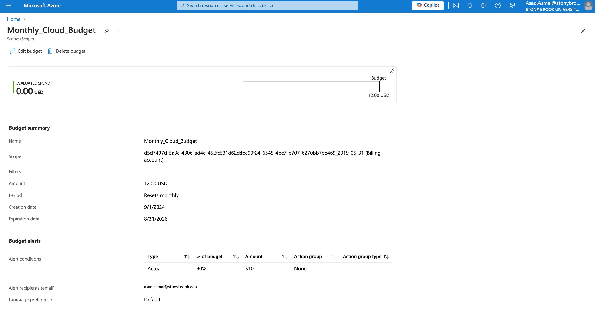
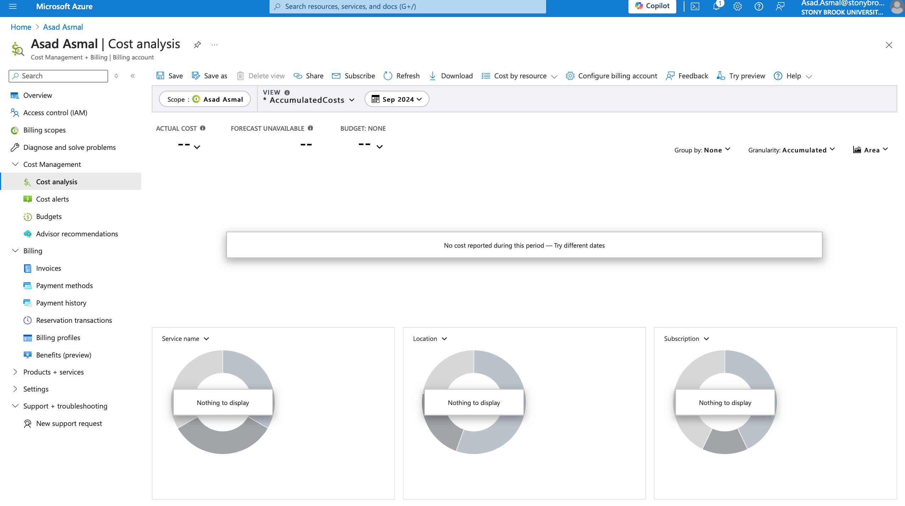
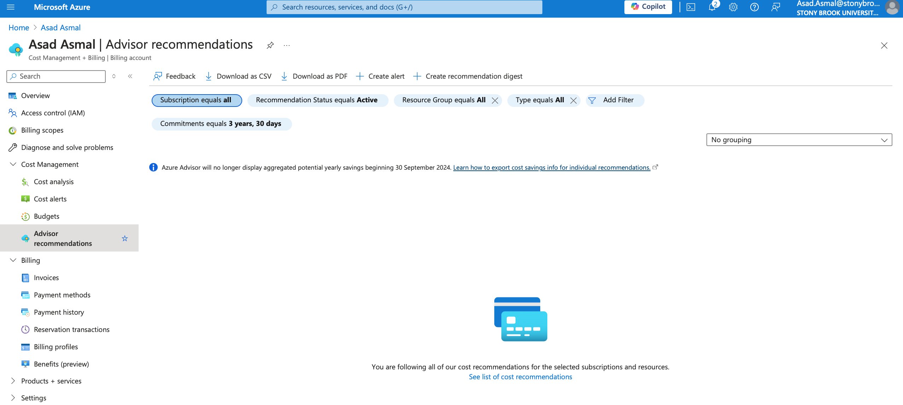
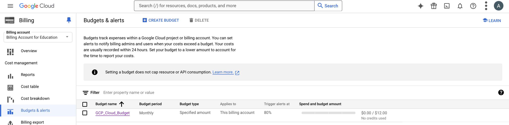
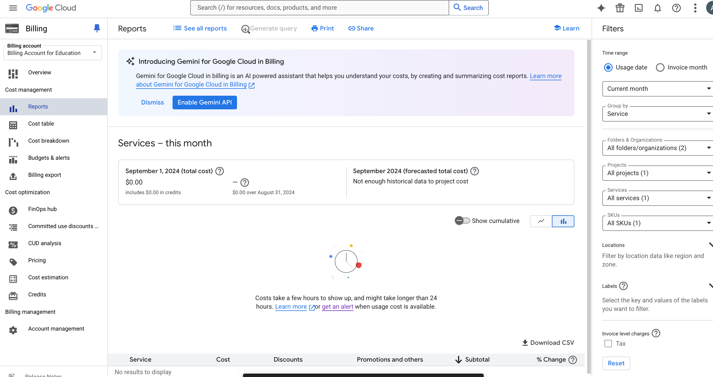
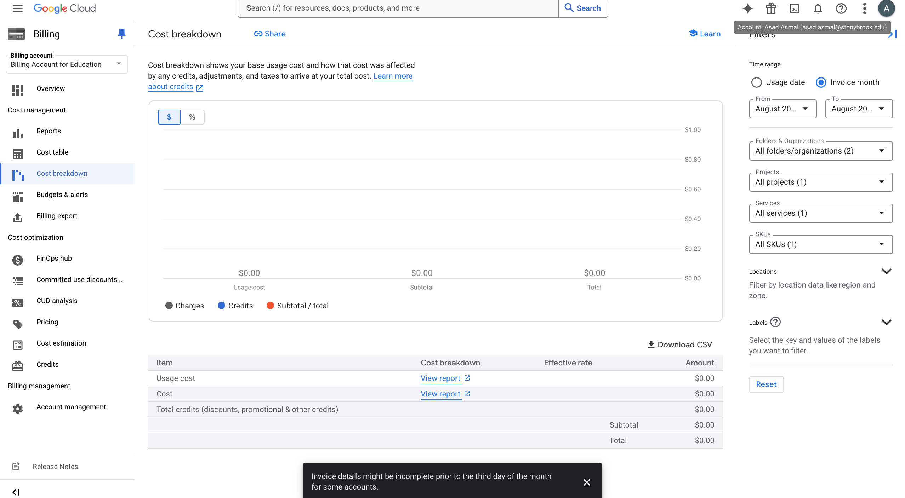

# Cost Management and Billing for Azure & GCP Assignment #

## Introduction ##

  This document will explore the cost management and billing features on both Azure and Google Cloud Platform (GCP). 
  This document will include the setup of the budgets that I created and also includes alerts and and an overview of certain features included on both platforms.

## Azure Cost Management ##

### Azure Budget Setup ###

- **Budget Amount**: $12
- **Alert Setup**: Alert was set at 80% of the budget which created a budget limit of $9.60
- **Dashboards Explored Include**: Cost Analysis, Forcasting and Azure Advisor Recomendations.
  
 

### Azure Cost Analysis Dashboard ###

- The Cost Analysis dashboard in Azure provides a detailed view of spending patterns and forecasted costs. In my screenshot no information was provided due to not using any services yet

### Azure Advisor Recommendations ###

- The Advisor Recommendations dashboard provides personalized suggestions to better use Azure's resources and reduce costs. 

## GCP Cost Management ##

### GCP Budget Setup ###
- **Budget Amount**: $12
- **Alert Setup**: Alert was set at 80% of the budget which created a budget limit of $9.60
- **Dashboards Explored Include**: Budget, Cost Breakdown and Reports

### GCP Reports Dashboard ###
- The GCP Reports dashboard provides a detailed overview of monthly spending trends, allowing users to track costs across different services. 

### GCP Cost Breakdown ###
- The Cost Breakdown dashboard provides an in-depth look at all expenses, including base charges, credits, adjustments, and taxes. 

## Conclusion ##
Both Azure and GCP provide detailed dashboards that can assist us with managing cloud costs more effectively. 

  
